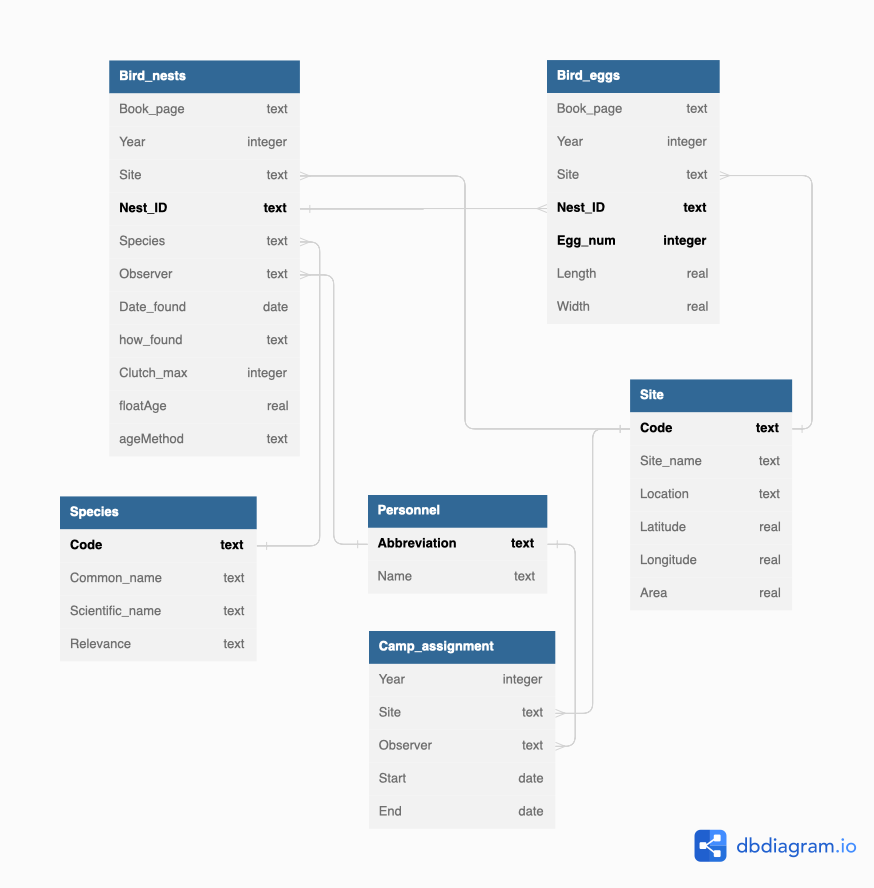

# SQL Essentials

### Overview

Greetings, this repository contains a collection of foundational SQL techniques used in tandem with bash, Python, and R. The practice problems and data in this repository were provided by the Bren School of Environmental Science & Management, UCSB Master in Environmental Data Science (MEDS) course EDS213.

EDS213: Databases and Data Management focused on how to store and manage environmental information using relational database structure, schemas, and data relationships by introducing SQL as a means to create and query databases. As well as, covered the concept of metadata and archiving data products on data repositories to make them available to the broader community.

This repository serves as a refresher from the course as it reviews essential commands and includes fun brain teasers to test understanding for the schema below. The data set is hosted by the [NSF Arctic Data Center](https://arcticdata.io) data repository. Further information on the Arctic Shorebird demographics network may be accessed here: <https://doi.org/10.18739/A2222R68W>

{width="500"}

### File Structure

Each respective `script` folder contains code relating SQL and the language labelled. The `data` folders hold the unprocessed (`raw`). Whereas the `images` folder contains the graphics displayed on this README.

```         
├── sql_essentials/
|   ├── sql_script/
|       ├── bash/
|       ├── Python/
|       ├── R/
|   ├── data/
|       ├── raw/
|       ├── processed/
|   ├── images/
|   ├── .gitignore
|   ├── README.md
|   ├── README.html
```

### References

```         
UCSB-Library-Research-Data-Services. bren-meds213-spring-2024-class-data (2024), GitHub repository, https://github.com/UCSB-Library-Research-Data-Services/bren-meds213-spring-2024-class-data

UCSB-Library-Research-Data-Services. bren-meds213-data-cleaning (2024), GitHub repository, https://github.com/UCSB-Library-Research-Data-Services/bren-meds213-data-cleaning
```
